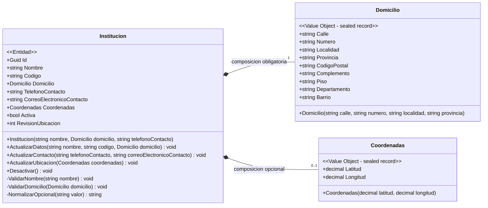

# Diagrama de Clases - Modulo Configuracion (Domain)

```mermaid
classDiagram
  direction LR

  class Institucion {
    &lt;&lt;Entidad&gt;&gt;
    +Guid Id
    +string Nombre
    +string Codigo
    +Domicilio Domicilio
    +string TelefonoContacto
    +string CorreoElectronicoContacto
    +Coordenadas Coordenadas
    +bool Activa
    +int RevisionUbicacion
    +Institucion(string nombre, Domicilio domicilio, string telefonoContacto)
    +ActualizarDatos(string nombre, string codigo, Domicilio domicilio) void
    +ActualizarContacto(string telefonoContacto, string correoElectronicoContacto) void
    +ActualizarUbicacion(Coordenadas coordenadas) void
    +Desactivar() void
    -ValidarNombre(string nombre) void
    -ValidarDomicilio(Domicilio domicilio) void
    -NormalizarOpcional(string valor) string
  }

  class Domicilio {
    &lt;&lt;Value Object - sealed record&gt;&gt;
    +string Calle
    +string Numero
    +string Localidad
    +string Provincia
    +string CodigoPostal
    +string Complemento
    +string Piso
    +string Departamento
    +string Barrio
    +Domicilio(string calle, string numero, string localidad, string provincia)
  }

  class Coordenadas {
    &lt;&lt;Value Object - sealed record&gt;&gt;
    +decimal Latitud
    +decimal Longitud
    +Coordenadas(decimal latitud, decimal longitud)
  }

  Institucion *-- "1" Domicilio : composicion obligatoria
  Institucion *-- "0..1" Coordenadas : composicion opcional
```
